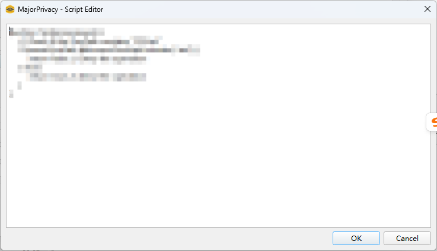

# 进入规则界面

在当前版本中，仅有文件对象保护规则支持自定义脚本。若需访问脚本编辑界面，请导航至“资源保护”标签页，并进入“创建规则”页面。

在“路径与操作”部分，您会看到一个名为“调用自定义脚本进行访问决策”的单选按钮。要启用此选项，需要将“操作”下拉菜单设置为“保护”。

勾选“调用自定义脚本进行访问决策”选项后，界面的右侧会出现一个按钮，如图 1 所示。点击该按钮将会弹出一个窗口，界面类似于图 2，可以在其中输入您的脚本。

配置好其他设置并保存规则后，脚本即可生效。

图 1

图 2

